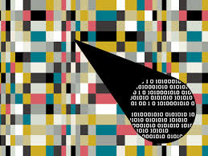

## Simple Steganography Javascript with Duke library
Simple Steganography with Javascript using DukeLearn library

<!--
*** Thanks for checking out the Best-README-Template. If you have a suggestion
*** that would make this better, please fork the repo and create a pull request
*** or simply open an issue with the tag "enhancement".
*** Thanks again! Now go create something AMAZING! :D
-->


<!-- PROJECT SHIELDS -->
<!--
*** I'm using markdown "reference style" links for readability.
*** Reference links are enclosed in brackets [ ] instead of parentheses ( ).
*** See the bottom of this document for the declaration of the reference variables
*** for contributors-url, forks-url, etc. This is an optional, concise syntax you may use.
*** https://www.markdownguide.org/basic-syntax/#reference-style-links
-->
![Contributors][contributors-shield]
[![MIT License][license-shield]][license-url]
[![LinkedIn][linkedin-shield]][linkedin-url]


<!-- PROJECT LOGO -->
<br />
<p align="center">
    
  </a>

  <h3 align="center">Simple Steganography using Javascript</h3>


<!-- TABLE OF CONTENTS -->
<details open="open">
  <summary>Table of Contents</summary>
  <ol>
    <li>
      <a href="#about-the-project">About The Project</a>
      <ul>
        <li><a href="#built-with">Built With</a></li>
      </ul>
    </li>
    <li><a href="#contact">Contact</a></li>
  </ol>
</details>


<!-- ABOUT THE PROJECT -->
## About The Project (In Spanish)

With this simple project you would be able to hide images in other images (Steganography) by replacing the 4 least important binary values of the color for every pixel of an image with the 4 most important binary values of the color for every pixel of the image you want to hide.


### Built With

* [Javascript](https://www.javascript.com/)
* [DukeLearnToProgram SimplePixel JSLibrary](https://www.dukelearntoprogram.com/course1/common/js/image/SimpleImage.js)


### Prerequisites

None

### Installation

1.- Clone the repository.

```sh
  git clone https://github.com/ANVRRT/SimpleSteganographyJS.git
```


<!-- LICENSE -->
## License

Distributed under the MIT License.

<!-- CONTACT -->
## Contact

Alberto Navarrete- [Linkedin](https://www.linkedin.com/in/albertonr/) - albertonavarreteramirez@gmail.com


<!-- MARKDOWN LINKS & IMAGES -->
<!-- https://www.markdownguide.org/basic-syntax/#reference-style-links -->
[contributors-shield]: https://img.shields.io/badge/CONTRIBUTORS-1-GREEN?style=for-the-badge
[license-shield]: https://img.shields.io/badge/LICENSE-MIT-GREEN?style=for-the-badge
[license-url]: https://github.com/othneildrew/Best-README-Template/blob/master/LICENSE.txt
[linkedin-shield]: https://img.shields.io/badge/-LinkedIn-black.svg?style=for-the-badge&logo=linkedin&colorB=555
[linkedin-url]: https://www.linkedin.com/in/albertonr/
[product-screenshot]: images/screenshot.png
